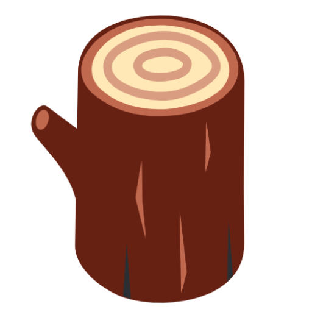

<div align="center">
  
  <h1>Module Stack</h1>
  <p>A collection of university modules and the "tech stack" they are on.</p>
</div>


## Contribute

To add/update a module, gather the following information:

- Date of update (`dateUpdated`) - Date that the information is gathered
- Link of module (`link`) - Relevant link to the module
- Code of module (`moduleCode`)
- Name of module (`moduleName`)
- School (`school`)
- Stack (`stack`) - An array of technologies taught/used in the module

If you are not familiar with or do not want to use `git`, submit a [new issue](https://github.com/tlylt/modstack/issues/new?template=add-new-mod.md) requesting the change. If you are already familiar with `git`, follow these steps:

1. If you haven't already, start by [forking](https://help.github.com/en/articles/fork-a-repo) this repository. 
2. [Create a new branch](https://help.github.com/en/desktop/contributing-to-projects/creating-a-branch-for-your-work) in your fork. Name it using the module you want to add/update 
3. Switch to that branch (should happen automatically if you've just created it) and open the `modstack.json` file
4. Use the information gathered above to add/edit a JSON entry in the following format (note the alphabetical order of keys):
```
  {
    "dateUpdated": "YYYY-MM-DD",
    "link": "https://any.link-to-a.source/will/work-and-wikipedia-is-cool",
    "moduleCode": "Module Code",
    "moduleName": "Module Name",
    "school": "Place that the module is offered",
    "stack": "[some|stack|here]"
  }
```
5. Finally, [create a Pull Request (PR)](https://help.github.com/en/articles/creating-a-pull-request) using the newly created branch (Important: DON'T use the `main` branch for the PR). Submit it with the necessary explanations.  


### Dated Updated
The day that the information is gathered.

### Module Code
The unique identifier of the module(fine to leave it empty if no such identifier exist).

### Module Name
The official name given to the module.
### Link
The Link should be a resource that provides more information about the module (fine to leave it empty if no such resources exist).

### Stack
The stack should be an array of technologies(as a string) either taught or used in the module. Examples will be programming languages required
for assignments and tutorials.

## Credits
This project is partly inspired by the interesting [Killed by Google](https://killedbygoogle.com/) project.